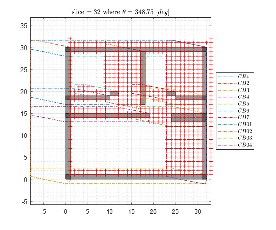
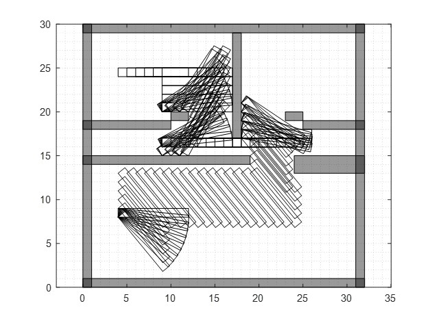
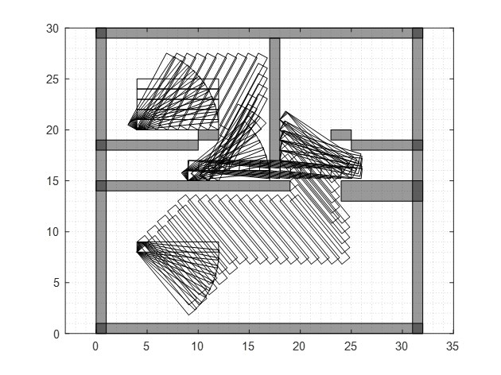

# Robot-Navigation
This repository includes the final project for the course Robot Navigation 036044 in ME at the Technion.

## Part 1
Main filename:  Part1.m     
Part 1 of the project is to find the C space boundary of multiple obstacles based on a given robot in 2D.   
The results are all given in the Part 1 report.

## Part 2
Main filename:  Part2.m     
In the second part of the project we created a grid and planned a robot navigation from start to a target (position and orientation)    
while avoiding the obstacles according to the "Bed_Movers_Problem.pdf".     
Following is sample slices of the grid with values representing valid positions of the robot CS
### Grid view sample slice
   

For the path finding algorithm we used BFS, DFS and A* and compared their performance.
Following are the path plans for A* and BFS:
### Breadth-First Search path
   

### A* path
   

